# IL_ROS_HSR

Code for finishing up the bed-making project. It's based on Michael Laskey's old code.

# Bed-Making Instructions

Here are full instructions for the bed-making project with the HSR.


- [Installation](#installation)
- [Setup for Data Collection](#setup-for-data-collection)
    - [The Bed Frame](#the-bed-frame)
    - [The Bed Sheet](#the-bed-sheet)
    - [The Robot](#the-robot)
- [Fast Data Collection](#fast-data-collection)
    - [Starting Configuration](#starting-configuration)
    - [Collecting Data](#collecting-data)
    - [Quick Inspection](#quick-inspection)
- [Slow Data Collection](#slow-data-collection)
- [Neural Network Training](#neural-network-training)
- [Evaluation](#evaluation)


## Installation

Install this and the [fast_grasp_detect repository][2]:

- I use the [requirements.txt file shown here][6] in my Python 2.7 virtualenv, but it's probably
  easy to just `pip install` things as you go. *From now on, I assume you are in the Python
  virtualenv*.
- Use `python setup.py develop` in the two repositories.
- Install TensorFlow 1.8.
- Install the TMC code library, which includes `hsrb_interface`.
- Adjust and double-check the [configuration file][1] and other paths, to ensure that you're
  referring to correct workspaces.
- Also double check that the overall data directory you're writing to is mounted and accessible.
- Make sure the HSR is charged, but that the charging tube is disconnected.

## Setup for Data Collection

First, set up the bed frame (and fix one side of the sheet). Second, during data collection, we'll
want to re-arrange the sheet on the bed in various configurations.

You should try and get the bed setup to look [like what we have in this GIF][5], with the exception
of perhaps the precise sheet (and with different robots if necessary). Also, don't put stuff on the
bed for now, just keep it a simple sheet. 

Notice the AR marker in the GIF --- we'll need this in the next section.


### The Bed Frame

To set up a bed, get the initial frame with a dark blue sheet fixed on it so it stays still, and
find a clear, open space. Having a fixed background (e.g., blue in this case) is useful for quickly
evaluating performance since we can measure the colors there using OpenCV. For space, the robot just
needs to go around one side of the bed, as shown in the images below. In addition, there also needs
to be space for an [AR 11 Marker][3], which is specific to the HSR (see below for instructions on
how to arrange the bed relative to the HSR). The AR marker must also be oriented correctly; rotating
it by 90 degrees, for instance, will change the other coordinate frames that we rely on.

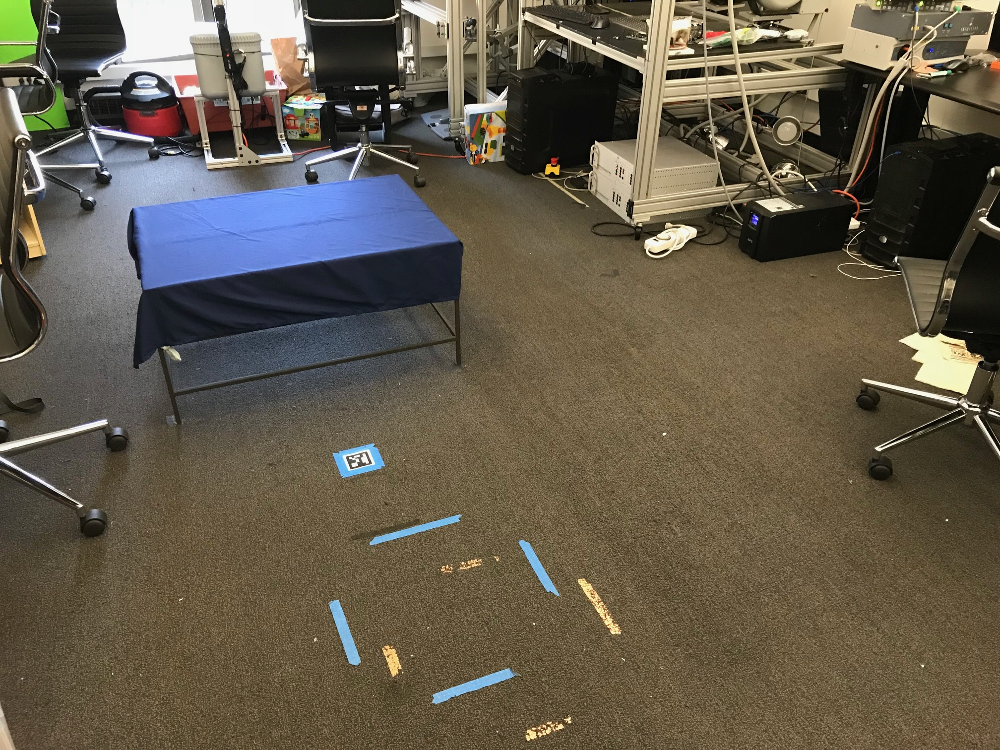

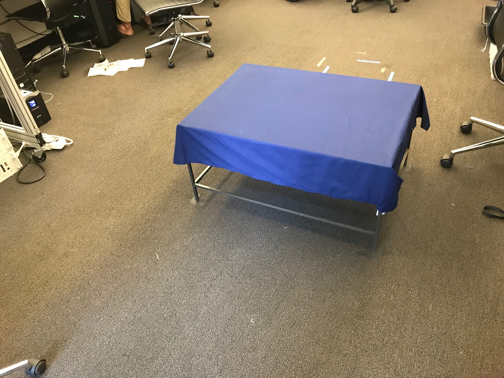

In terms of dimensions:

- The **bed frame** should be 26 x 36 inches in dimension. It's height is 18 inches.
- The **bed sheet** should be (about) 36 x 42 inches. I've found that this makes it reliably avoid
  issues with the corners lying over the edge of the bed, which should make it fine for collecting
  training data. The Cal and Teal blankets are 40 x 42 inches, so when applying transfer learning
  we'll probably want to increase the offset goal towards where the robot should pull the sheet and
  ensure that the setup avoids "extreme" cases with corners lying outside the top of the bed frame.

Align the 42 inch side of the bed with the 36 inch side of the bed frame, as expected.

For a fully flattened sheet, have 2-3 inches of extra space at the shorter end of the bed:

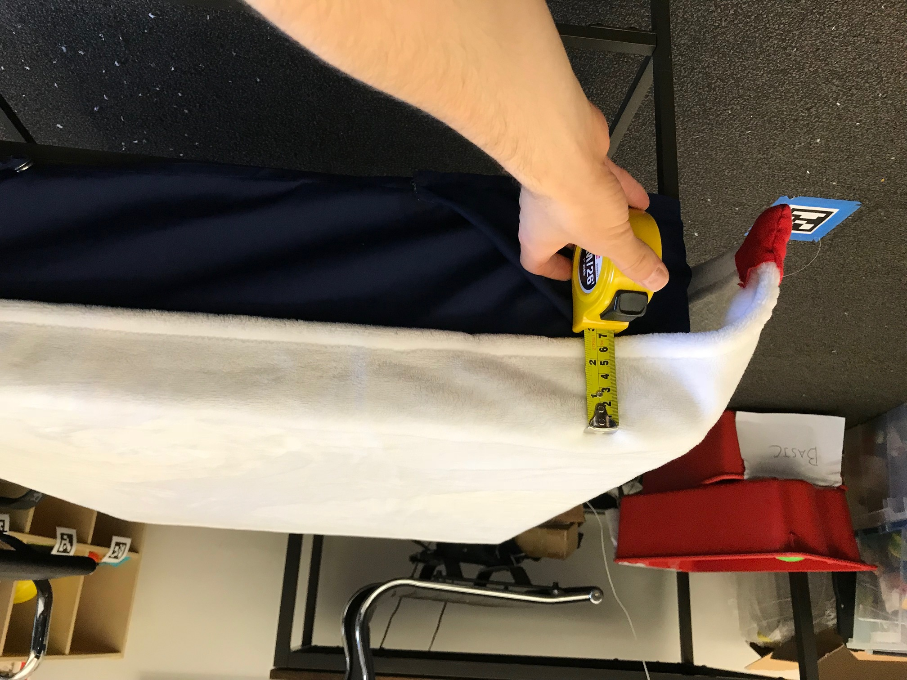

In addition, for the long side, have 5 inches or less extra space. If it's 6-7 inches or longer,
then this risks having more corners that are not on top of the bed frame, making it hard (if not
impossible) for the HSR to grasp at those points.

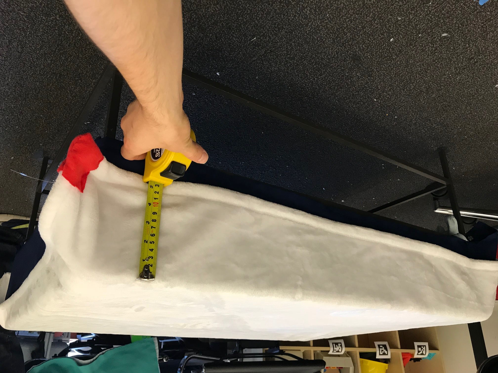

Apply pins in the back to make it sturdy. Double check that the previous measurements are still
roughly approximate.

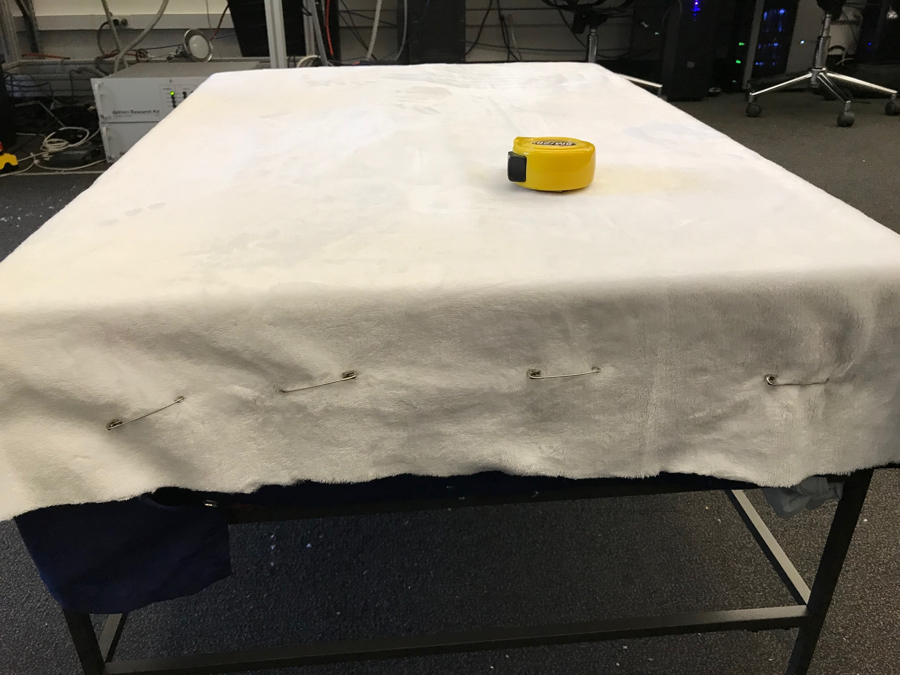

**Important note**: for now, we will keep the robot on the side closest to the AR marker, and then
we will rely on data augmentation techniques to "flip" the image so that we simulate being on the
opposite side. There are some issues to consider with this:

- There are some lighting issues with this, especially if we were using RGB (e.g., location of the
  light, windows, shadows, etc.), but since it's depth data I don't think it matters.
- We have a slightly different camera angle view from the opposite end of the bed in practice, but
  it's still minor compared to the original view and with some tuning we can probably change the
  target pose by comparing images and seeing if the bed is consistently in a similar configuration.
- **Most important**: we need to "simulate" grasping on the opposite side of the bed, so that the
  robot encounters states it is likely to encounter in practice. I'll explain more about this later
  during data collection.

Now we have the sheet on the bed, for initial data collection.  **How do we know where to precisely
put the bed?** Previously, we taped AR marker 11 on the ground, so move the HSR by using our
built-in joystick, so that it can see the AR marker in its cameras.  **For these steps, be sure you
are in HSRB mode (`export ROS_MASTER_URI ...`) and in the correct python virtual environment as
discussed earlier!** 

(And I assume, for the Fetch, you'll have to do something else to ensure the bed is aligned somehow
with whatever coordinate frames you're using for references.)

- Run `python scripts/joystick_X.py` first and then move the robot to the designated starting
  position. (It should be marked with tape ... put tape on if it isn't!)
- Kill the joystick script.
- In another tab, run `rosrun rviz rviz`.
- Get the bed setup by putting the bed towards where the rviz markers are located. Just a coarse
  match is expected and sufficient.  To be clear:
    - Match the following frames: `head up`, `head down`, `bottom up`, and `bottom down`.
    - The centers should be fixed, but the orientation can be a bit confusing ... for now I'll keep
      it the way it is. At least the blue axis (z axis I think) should point *downwards*. 
    - In order to do this step, you need to run `python main/collect_data_bed.py` first to get the
      frames to appear, but hopefully after this, no changes to the bed positioning are needed.
    - If you run this the first time, it is likely you will need to reposition the robot so that the
      AR marker is visible. Use rviz for visualizing, but again, this requires the data collection
      script to be run for the AR marker/11 frame to appear.
- The easiest way to do the last step above is by running `python main/collect_data_bed.py` ---
  which we have to do anyway for the data collection --- and adjusting at the beginning.

Here's what my rviz setup looks like:


Note I: the bed is as close to the AR marker as possible.

Note II: in the older project where grasp points =/= corner points, the `head_down` and `head_up`
frames were where we actually told the HSR gripper to go to after it gripped a sheet. Since we now
have corners, the corners need to be dragged slightly further away from the actual corner of the bed
frame. However, we'll leave `head_down` and `head_up` as frames that represent *bed frame
locations*.


### The Bed Sheet

In this section, we briefly review desiderata for how to set up the bed sheet assuming the frame and
setup is fixed as described earlier. For the actual procedure of data collection, and how to ensure
we get a diverse dataset [please see the next section](#fast-data-collection) as there are a few
extra considerations for when you collect the data *sequentially*. This section is more about the
stuff we should *avoid* in our *initial* sheet configuration.

1. The corner has to be visible (obviously). This is a limitation of our setup but for now just
arrange the sheet so the corners are visible.

2. Make sure the corner is on top of the bed frame, or just slightly off by 1-2 inches. The
following figure shows a borderline case where the corner is off the bed frame, but still *juust*
close enough that the HSR should be able to grip it. If the corner were further away from the frame,
the HSR couldn't grab it since it'd need to approach "sideways" and for now this is imposing some
un-necessary difficulties for our setup.

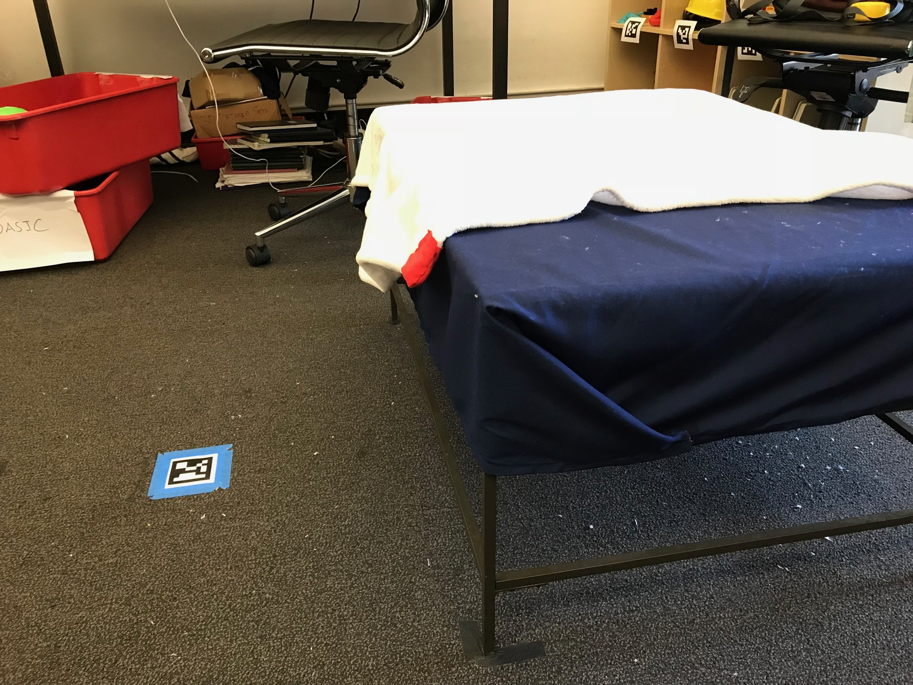

(Apologies for all the white dust-like particles you see ... our vacuum cleaner isn't working.)

3. Don't put the red marker on the opposite half of the bed where the data collection is occurring.
If the HSR is physically located on the left side of the bed in the below image, then its arm is
literally too short for it to grab the corner on that side. Make sure corners are in the closest
"half" to the robot. (The Fetch has a longer arm so it can get away with this, but let's please be
consistent with our data collection.)

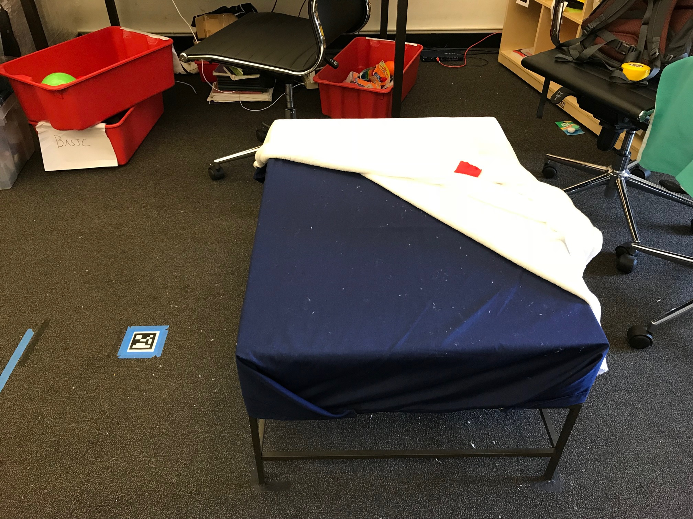

Now let's see how to collect data.

### The Robot

It is also necessary to get the robot aligned to "reasonable" positions so that the camera
viewpoints will be reasonably accurate. For example, with the Fetch, we use something like this,
where the Fetch measures roughly 19 inches away from the table.

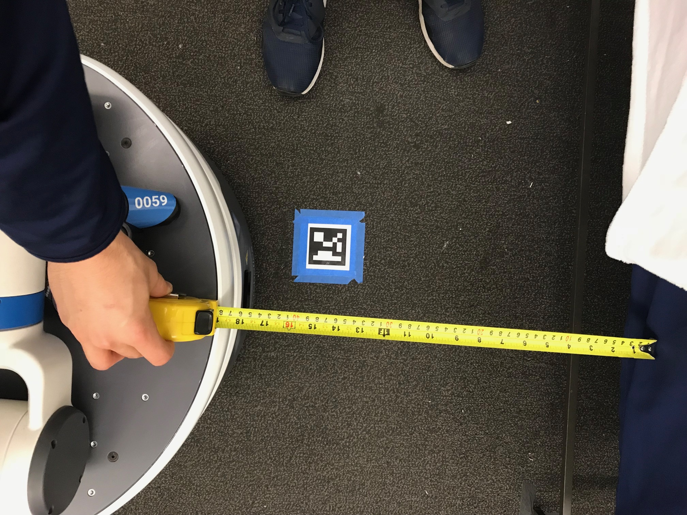

And another view:

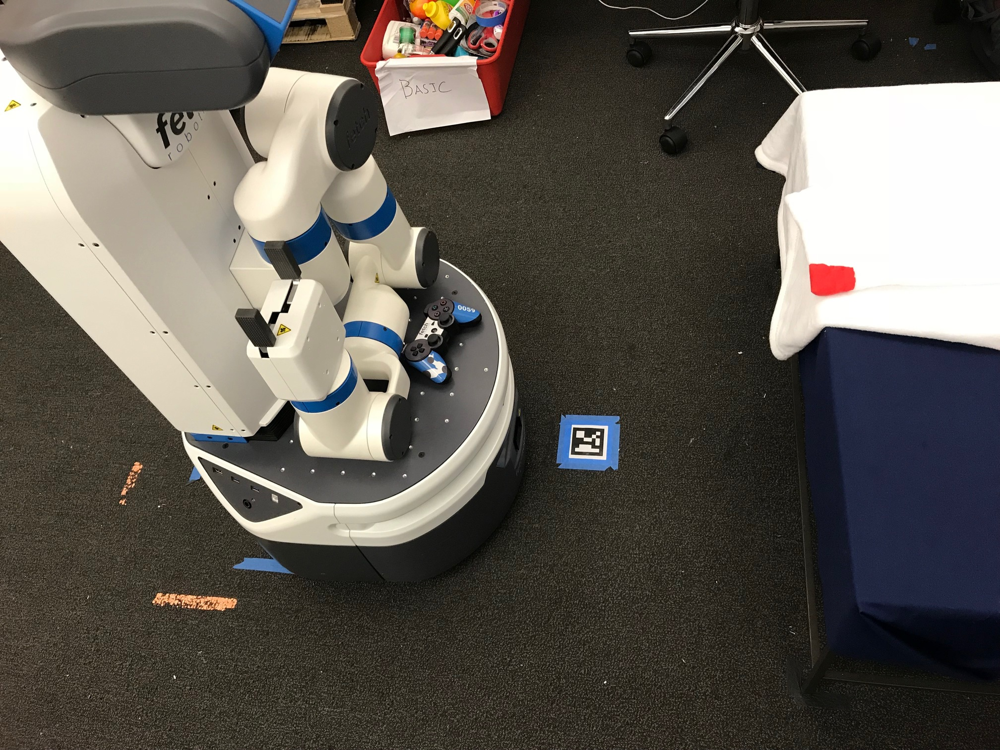

The Fetch here has pan at 0.0 degrees and tilt at 45 degrees, and the height is at its shortest
value, roughly 40-42 inches from the base. The HSR's default height is about 2 inches shorter, but
hopefully this difference is not too substantial (or we can increase the HSR's height by two inches
as well).

It's probably best if we collaborate on this. The point here is not to always get the same position
but to ensure they are "reasonably close" since (for example) depth images will be sensitive to the
distance of the robot and its camera angle.


## Fast Data Collection

For faster data collection, use a script like `python main/collect_data_bed_fast.py`. **(July 30,
2019, note: I have not updated it to include all the new 'randomness' that I talk about in the next
sub-section, as our HSR is currently not operational.)** The high-level description is that the
human manually arranges the sheets and then simulates what next sheets would look like given robot
actions. We do *not* actually move the robot from the bottom to top or execute grasps with the
robots. For that, see [the slow data collection](#slow-data-collection).

This way, we can get a decent amount of data (say, 130 images for the grasping network and 130
images for the success network) in 2-3 hours, rather than 2-3 days.  The main thing to be careful is
that we get data that the robot is likely to encounter in practice. In addition, when training the
success network, we need to have enough successes and failures to achieve reasonable class balance.

### Starting Configuration

In our code, before starting each "round" of data collection, we should have random number
generators tell us:

- Whether we simulate a grasp on the same side of the robot, or the opposite side.
- Whether the initial sheet should be flat, or wrinkled.
- How far away from the target we should set the red corner. For this, I pick a percentage between 0
  and 70 percent and try to roughly get the corner set that way. (You don't want it too close to the
  goal at the beginning since we'll be grasping and "deliberately failing early" so we cover those
  data points.)

This gives us different possible initial setups and considerations.

(By flat or wrinkled, we refer to the rough general shape of the edge of the sheet -- of course much
of this is up to human interpretation and the point is not to be exact in definitions but to
encourage us to get a diverse range of starting states instead of using the same starting state and
making our task look trivial/artificial. *Feel free to also add additional flags if they would help
create a more diverse, general dataset*.)

The reason for needing to simulate a grasp on the same side or opposite side is that the robot
always starts from a fixed side of the bed, and must succeed at that side before moving on to the
other. There are only two "rounds" at this, one for the first side ("bottom") and then for the other
side ("top"). But if we are collecting data quickly, we don't actually move the robot at all; we use
its camera sensors to collect images, but the robot base and arm are fixed throughout. Thus, we need
to simulate as if we were pulling the opposite side.

For example, here's a possible starting configuration if we wanted a sheet that was **wrinked**.
(These are actually borderline wrinkled for my initial bed collection style.)

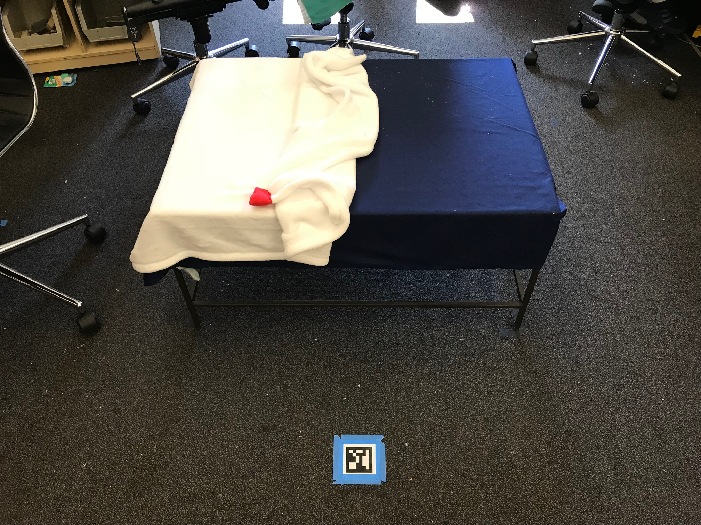

Now, if our RNG told us to start grasping as if we were on the bottom/starting side (same as the
side the ARK marker is on) then we just proceed with grasping as usual.

However, if we need to simulate if we're grasping from the top, then we need to pretend that the HSR
already grabbed the sheet appropriately from the other side. *This to ensure that the data we
collect is representative of the data that we have during during test-time.* To do this, we manually
pull the other side of the sheet:

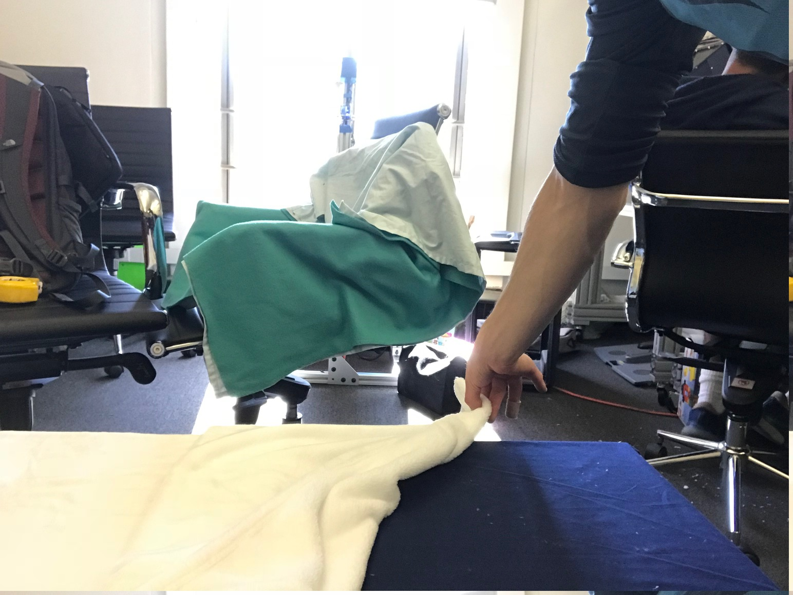

Then *this* becomes our "starting configuration":

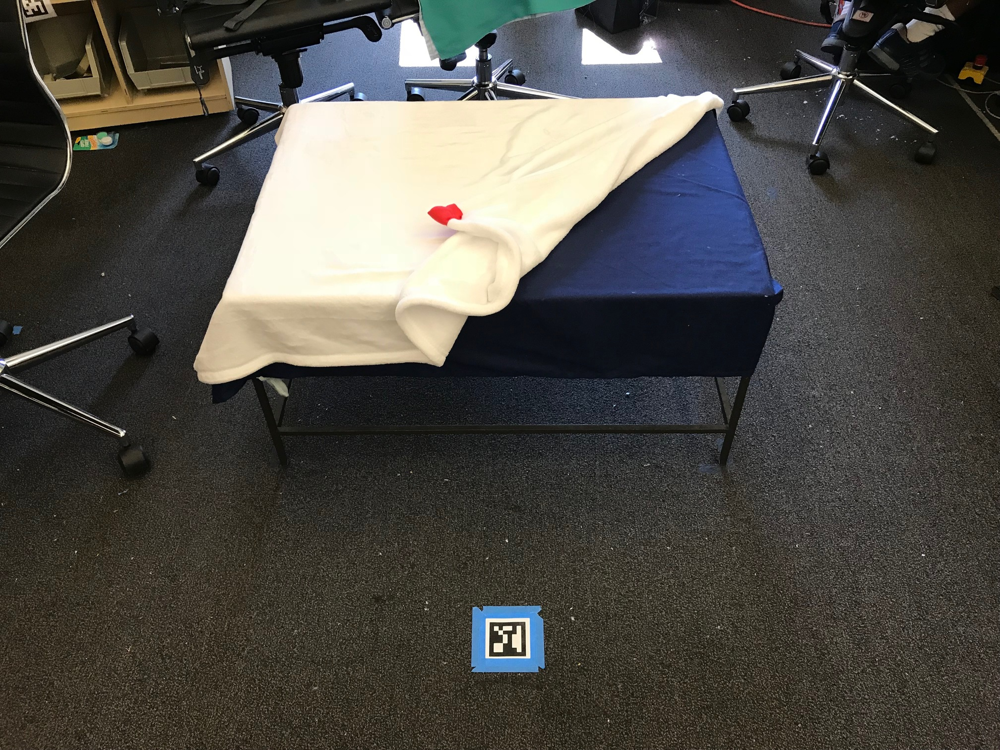

And in our training data, we perform flips about the vertical axis so that the robot "thinks" it's
seen cases of itself on the opposite side of the bed.

From then on, we proceed with grasping as usual. So, in short, the two different setups will result
in two different starting configurations. But it's important that in the second case, we act as if
we were the robot on the opposite side, so grip the corner and then move in a straight line to the
corner of the bed frame (with a slight offset of about 2 inches since the sheet is wider than the
bed frame). The above is typical of what the robot would see in the top side (except with a
horizontal flip) because the grip usually causes the corner to move further "inwards" into the bed.

All of this, of course, assumes we don't have a detachable red corner. If we did, it would probably
make more sense to collect maybe 20-ish images from the bottom side, then move the robot to the top,
collect 20-ish starting images there, etc. (but for the top side, we'd still need to manually
simulate a bottom grasp).


### Collecting Data

Given a starting configuration described earlier, we now perform a set of grasps. We propose that
each "rollout" involves two grasps+pull attempts by the human. The first one results in a failure.
The second one results in a success.

Let's look at another example. Say our RNG told us to (a) pull as if we were on the same side as the
robot, (b) that the sheet was flat, and (c) that the corner was closer to the opposite end of the
bed than the target. Then we might get this as our starting image (where for (c) we are at a
borderline case):

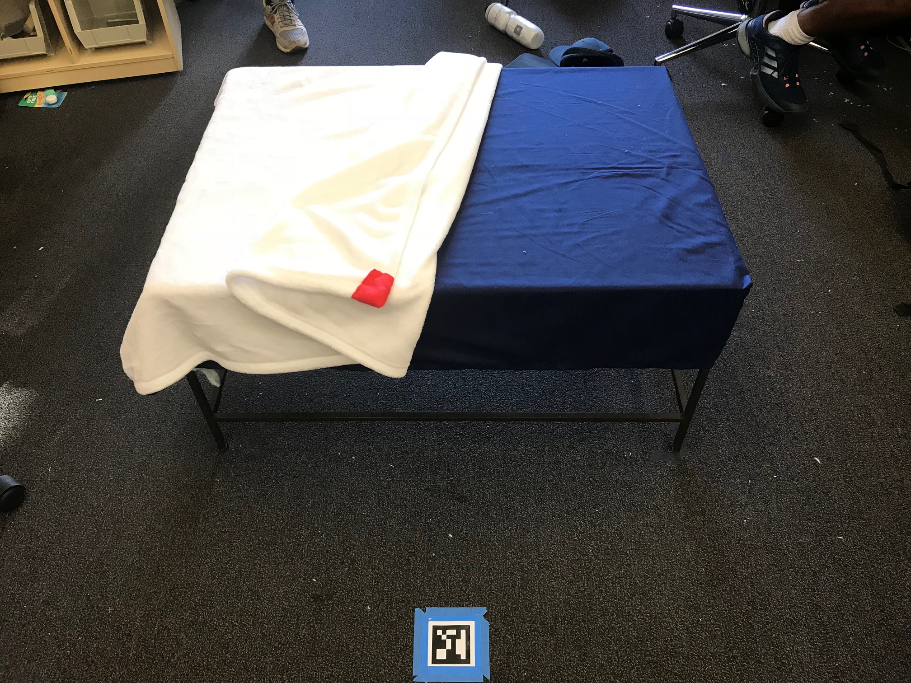

This image would be provided to the grasp network, along with the automatically-provided label.

The human manually moves the bed, acting as if it were pulling with a parallel-jaw grasp, and to a
target location at the corner but offset by 2-3 inches. However, *we want our first grasp+pull to be
a failure*, so the human drops the sheet prematurely, resulting in a configuration such as:

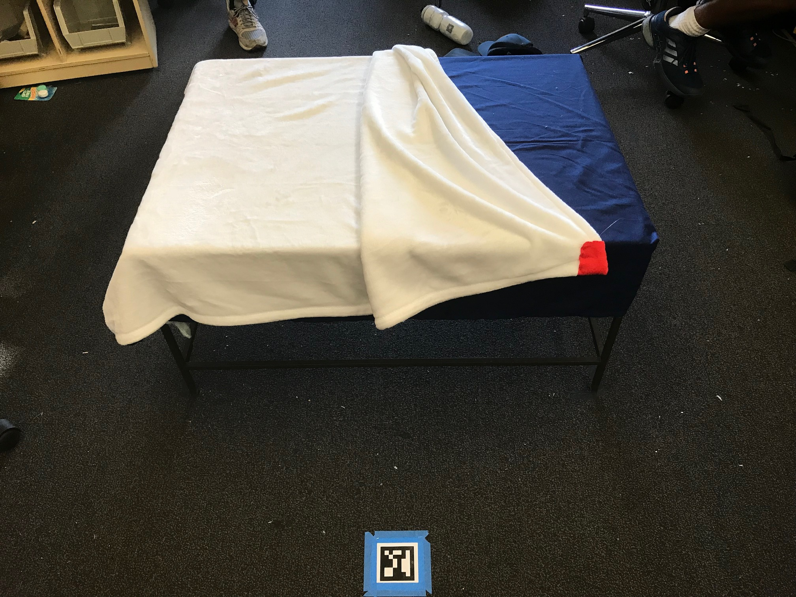

The above image is part of the success network data, with the label "failure." It is *also* an image
that the grasp network sees, since we have to re-grasp it.

The human then does a second grasp+pull, result in a success:

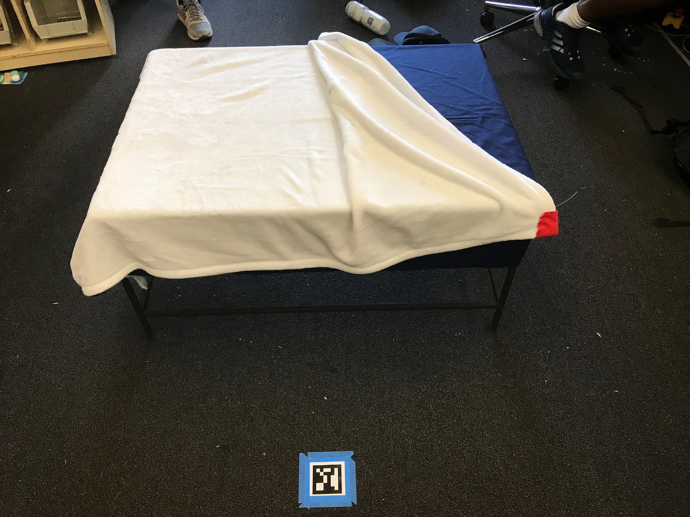

And the above image is part of the success network data, with the label "success."

So from the above rollout:

- We get two images for each of the grasp and success networks. One image is shared for both
  networks.
- The success network sees one positive and one failure case, helping with class balance.

**We need to be consistent with how we label success/failures. I propose successes as when the sheet
means we can't see the corner**. Here's an example of some borderline cases. I would label this as a
success:


and this as a failure.

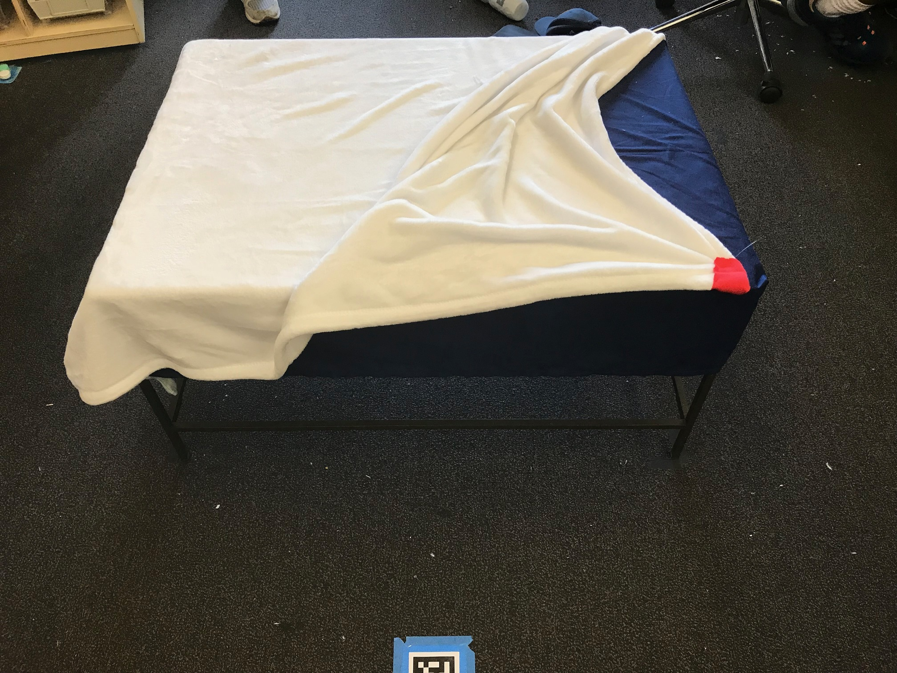

**It only matters the corner closest to the bottom. Forget the top, it's irrelevant for the success
network**, and as explained above we sometimes simulate as if we did the top first.

After this we are finished with this "rollout" and we should save it and then reset the starting
configuration.


### Quick Inspection

**After data is collected, do the following immediately**:

- Inspect it, along with data augmentation. Try scripts similar to `python
  scripts/check_raw_data.py` or `python scripts/data_augmentation_example.py`, with appropriate file
  paths and other settings adjusted. This will catch some obvious issues.
- See how well an analytic baseline metric would do in detecting grasp points (or corners). For
  instance, we can take the RGB images (since all RGB+depth are collected simultaneously) and do
  contour detection on the blue bed frame and then pick the corner of that closest to the white
  sheet. This gives us a baseline to further improve on with deep learning.


## Slow Data Collection

Note: this is outdated but useful as a reminder for how to use `main/collect_bed_data.py`.

1. As mentioned above, run `python main/collect_data_bed.py`. Make sure there are no error messages. 

    - If there are no topics found initially, that likely means the AR marker is not visible. Please
      check rviz.
    - For each setup, originally we sampled a starting bed configuration with a red line and then
      had to *physically adjust the bed sheet to match that image*. This provides the variation in
      starting states. However, the red lines turned out to be pretty poorly located, so I just went
      with four conditions, a 2x2 combination of whether we wanted the white underside of the Cal
      blanket visible, and whether we wanted the sheet curved or not.

2. After the sheet has been adjusted, the robot can move.

    - Press B on the joystick. Then the robot should move up to the bed, and pause.
    - An image loader/viewer pops up. Click "Load" (upper right corner) to load the current camera
      image of the robot.
    - Drag the bounding box where the robot should grasp. Click "send command" and then close the
      window. *The grasp will not execute until the window is closed*.

3. After the grasp, we need to check for transitioning vs re-grasping.

    - Load the image as usual by clicking "Load". 
    - Below the "Load" button, drag and drop either "Success" or "Failure" depending on what we
      think happened.
    - Click "Confirm Class". This is especially important! What matters is the class that you see in
      the list that appears.
    - Draw a bounding box. I don't think it matters if we know the robot transitions, but if the
      robot has to re-grasp, then definitely put the correct pose.
    - Send the command, close the window.

4. Data Storage

    - After the HSR has transitioned to the start, it will save the data under the specified
      directory, as `rollout_X.p` where `X` is the index. Check the print logs for the location.
    - The `rollout_X.p` is a list of length K, where K>=5.  Use `scripts/quick_rollout_check.py` to
      investigate quickly.  It contains:
        - A list of two 3-D points, representing the "down corner" and "up corner" respectively,
          which are used for the initial state sampling. (Note: let's just ignore this.)
        - And then a bunch of dictionaries, all with these keys:
            - `c_img`: camera image. Note that if a grasp just failed, then the subsequent image
              that the success network would see is the same exact image as the grasping network
              would see. This makes sense: at attempt `t` just after we think a grasp failure
              happened, the image `I` is what the success net would see, so it must classify it as a
              failure. Then in the next dictionary, `I` stays the same since we have figure out
              where to grasp next.
            - `d_img`: depth image. Don't worry about this too much.
            - `class`: either 0 (success/good) or 1 (failure/bad), use these for the 'success' type.
            - `pose`: a 2D point from where we marked it in the interface.  You'll see it in the
              Tkinter pop-up menu. Use these for the 'grasp' types.
            - `type`: 'grasp' or 'success'
            - `side`: 'BOTTOM' or 'TOP' (the HSR starts in the bottom position)
        - These repeat for each grasp and success check, and for both sides.  The first dictionary
          is of type 'grasp' and represents the data that the grasping network would see, and has
          'pose' as the center of the bounding box we drew. The second dictionary is of type
          'success' for a success check, and which also lets us draw a bounding box. Two cases:
            - *First grasp succeeded?* The next dictionary has `c_img` corresponding to the top of
              the bed, with type 'grasp', and has a different `pose` corresponding to the next
              bounding box we drew.  So the bounding box we draw for the success network, assuming
              the previous grasp succeeded, is ignored.
            - *First grasp failed?* The next dictionary has the same `c_img` as discussed above,
              with type 'grasp'. It also has the same `pose` since we should have drawn it just now.
              (The pose is also effectively ignored, except during the interface, we need to be
              careful about where we draw the pose in this case because it immediately impacts the
              next grasp attempt.)
          The cycle repeats. So either way the two types alternate.
      Hence, the shortest length of `rollout_X.p` is 5, because the bottom and top each require two
      dictionaries (one each for grasping and then the success). Of course, it will be longer
      whenever we have to re-grasp.

Here's an example of the pop-up menu. In the "Bounding Boxes" the class that gets recorded is shown
there. Once you see something like this, you can "Send Command" and close it.


After collecting data, **immediately check the analytic version** of our problems, to get a good
baseline for accuracy (either grasping or, less likely, successes).


## Neural Network Training

(The training comes from the `fast_grasp_detect` repository.)

0. Data dimension: by default we do NOT use the raw (480,640,3)-sized images, but we pass them
through a pre-trained YOLO network to get (14,14,1024)-dimensional features, and THEN we do the rest
of the stuff from there. In other words, when we call a training minibatch, we will get a batch of
size (B,14,14,1024). **TODO: support for training end-to-end is in progress.**

1. Collect and understand the data. 

    - The easiest way to understand the data is by running: `python scripts/check_raw_data.py` as
      that will give us statistics as well as save images that we can use for later.
    - Also do `python scripts/data_augmentation_example.py` to check data augmentation, for both 
      the depth and the RGB images (check the code to change settings).

2. Investigate what kind of training works best for the grasp data. For this, perform cross
validation on the grasping data. (And maybe the success data, but for now just do grasping.)

    - Check the configuration file for grasping. Make sure:
        - `self.PERFORM_CV = True`
        - `self.CV_HELD_OUT_INDEX` is set to a number between 0 and 9, inclusive.
        - `self.ROLLOUT_PATH` refers to where all the 50 (or so) rollouts are stored.
        - `self.CV_GROUPS` splits the rollouts randomly and evenly into groups.
    - Run `python train_bed_grasp.py`. It should load in the network and the data, and will save in
      `grasp_output/`, with the following information by default:
       ```
       seita@autolab-titan-box:/nfs/diskstation/seita/bed-make$ ls -lh grasp_output/*
       -rw-rw-r-- 1 nobody nogroup 336M Jul  5 17:25 grasp_output/07_05_17_24_56_CS_0_save.ckpt-500.data-00000-of-00001
       -rw-rw-r-- 1 nobody nogroup 2.3K Jul  5 17:25 grasp_output/07_05_17_24_56_CS_0_save.ckpt-500.index
       -rw-rw-r-- 1 nobody nogroup 692K Jul  5 17:25 grasp_output/07_05_17_24_56_CS_0_save.ckpt-500.meta
       -rw-rw-r-- 1 nobody nogroup 336M Jul  5 17:26 grasp_output/07_05_17_26_09_CS_0_save.ckpt-1000.data-00000-of-00001
       -rw-rw-r-- 1 nobody nogroup 2.3K Jul  5 17:26 grasp_output/07_05_17_26_09_CS_0_save.ckpt-1000.index
       -rw-rw-r-- 1 nobody nogroup 692K Jul  5 17:26 grasp_output/07_05_17_26_09_CS_0_save.ckpt-1000.meta
       -rw-rw-r-- 1 nobody nogroup  324 Jul  5 17:26 grasp_output/checkpoint
       
       grasp_output/2018_07_05_17_23:
       total 4.0K
       -rw-rw-r-- 1 nobody nogroup 2.0K Jul  5 17:23 config.txt
       
       grasp_output/stats:
       total 4.0K
       -rw-rw-r-- 1 nobody nogroup 720 Jul  5 17:26 grasp_net.p
       ```
        - `config.txt` file is saved in a file reflecting the time the code was run, and has all
          the configurations, so we always know what we ran. :)
        - `stats/grasp_net.p` is a dict where 'test' and 'train' are the test and train losses,
          respectively, saved at some fixed epochs.
        - The other stuff, of course, is from `tf.Saver`.
    - Do something similar to the above for the "success" data.

3. Now train for real. As before, we run `python train_bed_grasp.py` and `python
train_bed_success.py` in the `fast_grasp_detect` repository. But this time make sure
`self.PERFORM_CV = False` so that all the CV stuff is ignored.


## Evaluation

1. Run `python deploy_network.py` for testing the method we propose with deep imitation learning.

2. Run `python deploy_analytic.py` for testing the baseline method.

3. Plot, analyze, and visualize with our many scripts in `scripts/`.

Reminders:

1. Error bars, error bars, error bars.


[1]:https://github.com/DanielTakeshi/IL_ROS_HSR/blob/master/src/il_ros_hsr/p_pi/bed_making/config_bed.py
[2]:https://github.com/DanielTakeshi/fast_grasp_detect
[3]:https://docs.hsr.io/manual_en/development/ar_marker.html
[4]:https://github.com/DanielTakeshi/fast_grasp_detect/commit/424463e12996b037c3f3539e58d1b5572f4ca835
[5]:http://bair.berkeley.edu/static/blog/dart/bed_making_gif.gif
[6]:https://github.com/DanielTakeshi/IL_ROS_HSR/blob/master/requirements.txt
