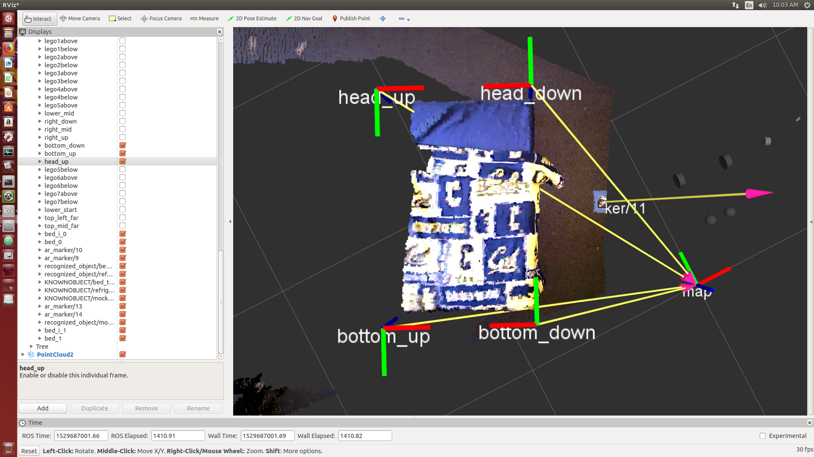
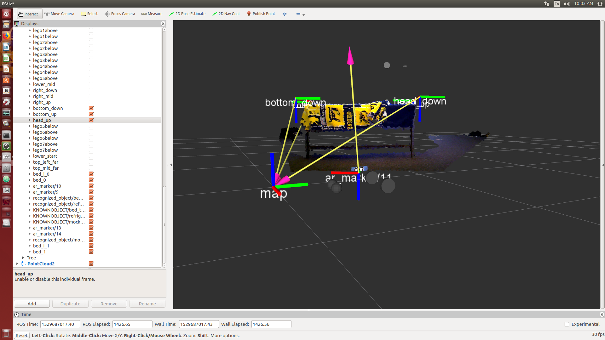
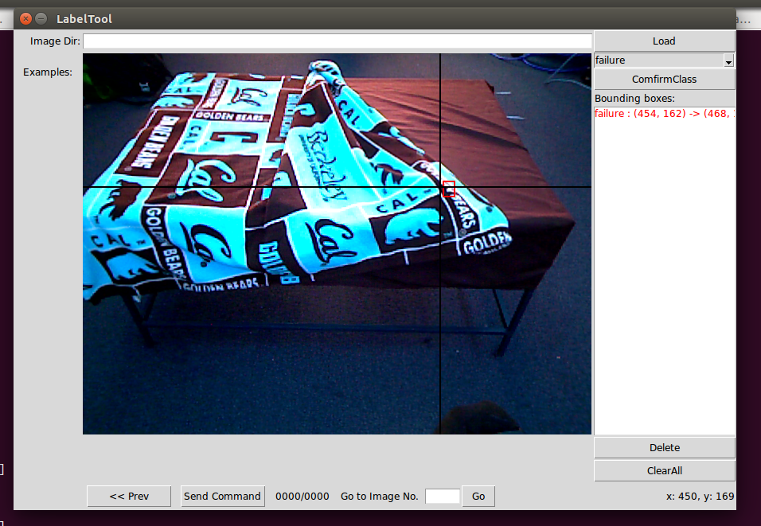

# IL_ROS_HSR

A repo for performing imitation learning experiments on a ROS-compatible Toyota
HSR

Daniel Seita's fork of this repository for finishing up the bed-making project,
but it's also flexible enough to deal with other projects.

Currently, it is working to do some of the bed making rollouts, but need to
double check that all the paths are referring to my stuff instead of Michael's
package.

# Bed-Making Instructions

Here are full instructions for the bed-making project.

## Preliminaries and Setup

1. Install this and the [fast_grasp_detect repository][2]:

    - Use `python setup.py develop` in the two repositories.
    - Install TensorFlow 1.4 or 1.5.
    - Install the TMC code library, which includes `hsrb_interface`.
    - TODO: need to get a requirements text somewhere.
    - Adjust and double-check the [configuration file][1] and other paths, to
      ensure that you're referring to correct workspaces. TODO: need to get this
      in the configuration rather than `sys.path.append(...)` calls in the code.
    - Also double check that the overall data directory (by default
      `/media/autolab/1tb/[something...]`) is mounted and accessible for data
      writing.
    - Make sure the HSR is charged, but that the charging tube is disconnected.

2. Make sure an AR maker is taped on the ground, [and that it is AR maker
11][3], and that the robot is in a good starting position by using the joystick,
so that it can see the AR marker. **For these steps, be sure you are in HSRB
mode (`export ROS_MASTER_URI ...`) and in the correct python virtual
environment!**

    - Run `python scripts/joystick_X.py` first and then move the robot to the
      designated starting position. (It should be marked with tape ... put tape
      on if it isn't!)
    - Turn off the joystick script.
    - In another tab, run `rosrun rviz rviz`.
    - Get the bed setup by putting the bed towards where the rviz markers are
      located. Just a coarse match is expected and sufficient.  To be clear:
      - Match the following frames: `head up`, `head down`, `bottom up`, and
        `bottom down`.
      - The centers should be fixed, but the orientation can be a bit confusing
        ... for now I'll keep it the way it is. At least the blue axis (z axis I
        think) should point *downwards*. 
      - In order to do this step, you need to run `python
        main/collect_data_bed.py` first to get the frames to appear,
        but hopefully after this, no changes to the bed positioning are needed.
      - If you run this the first time, it is likely you will need to reposition
        the robot so that the AR marker is visible. Use rviz for visualizing,
        but again, this requires the data collection script to be run for the AR
        maker/11 frame to appear.
    - The easiest way to do the last step above is by running `python
      main/collect_data_bed.py` --- which we have to do anyway for the data
      collection --- and adjusting at the beginning.

Here's what my rviz setup looks like:

Note that the bed is as close to the AR marker as possible.

## Data Collection

1. As mentioned above, run `python main/collect_data_bed.py`. Make sure there
are no error messages. 

    - If there are no topics found initially, that likely means the AR marker is
      not visible. Please check rviz.
    - For each setup, we sample a starting bed configuration with a red line and
      then have to *physically adjust the bed sheet to match that image*. This
      provides the variation in starting states. Again, only coarse matches are
      needed. However, please keep the bed adjusted so that it is close to the
      z-axis (colored blue) of the two bottom poses.

2. After the sheet has been adjusted, the robot can move.

    - Press B on the joystick. Then the robot should move up to the bed, and
      pause.
    - An image loader/viewer pops up. Click "Load" (upper right corner) to load
      the current camera image of the robot.
    - Drag the bounding box where the robot should grasp. Click "send command"
      and then close the window. *The grasp will not execute until the window is
      closed*.

3. After the grasp, we need to check for transitioning vs re-grasping.

    - Load the image as usual by clicking "Load". 
    - Below the "Load" button, drag and drop either "Success" or "Failure"
      depending on what we think happened.
    - Click "Confirm Class". This is especially important! What matters is the
      class that you see in the list that appears.
    - Draw a bounding box. I don't think it matters if we know the robot
      transitions, but if the robot has to re-grasp, then definitely put the
      correct pose.
    - Send the command, close the window.

4. Data Storage

    - After the HSR has transitioned to the start, it will save the data under
      the specified directory, as `rollout_X.p` where `X` is the index. Check
      the print logs for the location.
    - The `rollout_X.p` is a list of length K, where K>=5.  Use
      `scripts/quick_rollout_check.py` to investigate quickly.  It contains:
        - A list of two 3-D points, representing the "down corner" and "up
          corner" respectively, which are used for the initial state sampling.
        - And then a bunch of dictionaries, all with these keys:
            - `c_img`: camera image. Note that if a grasp just failed, then
              the subsequent image that the success network would see is the
              same exact image as the grasping network would see. This makes
              sense: at attempt `t` just after we think a grasp failure
              happened, the image `I` is what the success net would see, so it
              must classify it as a failure. Then in the next dictionary, `I`
              stays the same since we have figure out where to grasp next.
            - `d_img`: depth image. Don't worry about this too much.
            - `class`: either 0 (success/good) or 1 (failure/bad), though can be
              confusing with temporal drift. At grasp attempt `t`, say it
              failed. Then the next dict for the success net sees a failure
              (class=1) but that is immediately carried over to the next dict
              for the *grasp* net at attempt `t+1`, so it also sees class=1 even
              though that grasp may actually be successful; if it is, the *next*
              success net's dict finally has class=0 and then grasp attempt
              `t+2` sees class=0 even though *that* may fail ...  ugh.
            - `pose`: a 2D point from where we marked it in the interface.
              You'll see it in the Tkinter pop-up menu. It's the *center* of the
              bounding box drawn.
            - `side`: 'BOTTOM' or 'TOP' (the HSR starts in the bottom position)
            - `type`: 'grasp' or 'success'
        - These repeat for each grasp and success check that we have, and repeat
          for the top. Example: The first dictionary is of type 'grasp' and
          represents the data that the grasping network would see, and has
          'pose' as the center of the bounding box we drew. The second
          dictionary is of type 'success' for a success check, and which also
          lets us draw a bounding box. Two cases:
            - *First grasp succeeded?* The next dictionary has `c_img`
              corresponding to the top of the bed, with type 'grasp', and has a
              different `pose` corresponding to the next bounding box we drew.
              So the bounding box we draw for the success network, assuming
              the previous grasp succeeded, is (effectively) ignored.
            - *First grasp failed?* The next dictionary has the same
              `c_img` as discussed above, with type 'grasp'. It also has the
              same `pose` since we should have drawn it just now. (Though, I
              suppose, the pose is also effectively ignored, except during the
              interface, we need to be careful about where we draw the pose in
              this case because it immediately impacts the next grasp attempt.)
          The cycle repeats. So either way the two types alternate.
      Hence, the shortest length of `rollout_X.p` is 5, because the bottom and
      top each require two dictionaries (one each for grasping and then the
      success). Of course, it will be longer whenever we have to re-grasp.

Here's an example of the pop-up menu. In the "Bounding Boxes" the class that
gets recorded is shown there. Once you see something like this, you can "Send
Command" and close it.

5. Other stuff

    - **TODO: DART?**
    - **TODO: faster ways to collect data?**

## Neural Network Training

1. Collect the data in an appropriate manner.
2. Run `python train_bed_grasp.py` and `python train_bed_success.py` in the
`fast_grasp_detect` repository.

## Evaluation

1. Run `python deploy_network.py` for testing the method we propose with deep
imitation learning (with DART ideally).
2. Run `python deploy_analytic.py` for testing the baseline method.

[1]:https://github.com/DanielTakeshi/IL_ROS_HSR/blob/master/src/il_ros_hsr/p_pi/bed_making/config_bed.py
[2]:https://github.com/DanielTakeshi/fast_grasp_detect
[3]:https://docs.hsr.io/manual_en/development/ar_marker.html
[4]:https://github.com/DanielTakeshi/fast_grasp_detect/commit/424463e12996b037c3f3539e58d1b5572f4ca835
